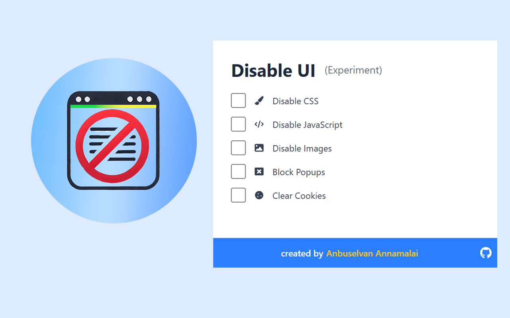

# Disable UI - Chrome Extension

[](https://github.com/anburocky3/disable-css-js-extension)
[](https://github.com/anburocky3/disable-css-js-extension)
[](https://github.com/anburocky3/disable-css-js-extension)

[](https://bit.ly/cyberdudeDiscord)
[](https://bit.ly/cyberdudeYT)


A powerful Chrome extension that gives you control over webpage UI elements. Selectively disable CSS, JavaScript, images, popups, and manage cookies with a simple toggle interface.



## ✨ Features

- 🎨 **Disable CSS**: Remove all styling from the webpage
- 📜 **Disable JavaScript**: Turn off JavaScript execution
- 🖼️ **Disable Images**: Remove all images from the page
- 🚫 **Block Popups**: Prevent popup windows
- 🍪 **Clear Cookies**: Manage cookies for the current site
- 💾 **State Persistence**: Settings are saved per tab
- 🔄 **Instant Preview**: See changes immediately with reload option

## 🚀 Installation

### Local Development

1. [Fork](https://github.com/anburocky3/disable-css-js-extension/fork) or Clone the repository:

   ```bash
   git clone https://github.com/anburocky3/disable-css-js-extension.git
   cd disable-css-js-extension
   ```

2. Install dependencies:

   ```bash
   npm install
   ```

3. Build the extension:

   ```bash
   npm run build
   ```

4. Load in Chrome:
   - Open Chrome and navigate to `chrome://extensions/`
   - Enable "Developer mode" in the top right
   - Click "Load unpacked"
   - Select the `build` folder from the project directory

### Chrome Web Store

_(Coming soon)_

## 🎯 Usage

1. Click the extension icon in your Chrome toolbar
2. Toggle the features you want to disable:
   - CSS styling
   - JavaScript functionality
   - Images
   - Popup windows
   - Cookies
3. Click "Apply Changes"
4. Click "Reload Page" to see the changes

💡 **Tip**: Changes are saved per tab, so you can have different settings for different websites!

## 🤝 Contributing

Contributions are welcome! Here's how you can help:

1. Fork the repository
2. Create a feature branch: `git checkout -b feature/amazing-feature`
3. Commit your changes: `git commit -m 'Add amazing feature'`
4. Push to the branch: `git push origin feature/amazing-feature`
5. Open a Pull Request

### Publishing to Chrome Web Store

To create a distribution package for the Chrome Web Store:

1. Update the version in `package.json`
2. Run the publish command:
   ```bash
   npm run publish
   ```
3. The command will:
   - Build the extension
   - Create a ZIP file named `disable-css-js-extension-[version].zip`
   - Provide instructions for Chrome Web Store submission

## 📝 License

This project is licensed under the MIT License - see the [LICENSE](LICENSE) file for details.

## 👨‍💻 Author

**Anbuselvan Annamalai**

- GitHub: [@anburocky3](https://github.com/anburocky3)
- Website: [https://anburocky3.github.io](https://anburocky3.github.io)

## 🙏 Acknowledgments

- Built with React + TypeScript
- Styled with Tailwind CSS
- Icons from React Icons

---

Made with ❤️ by [Anbuselvan Annamalai](https://github.com/anburocky3)
